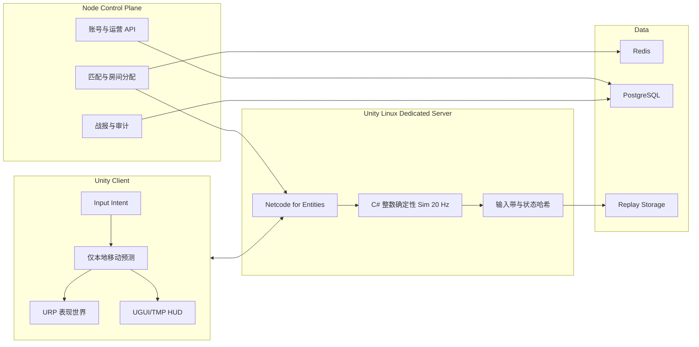

# 《三命无常》Unity 极致性能迁移规划

文档版本：0.1.3
日期：2026-07-24
状态：U0 工具链和三类构建已验证，U1 客户端基线采样已落地；真机与性能门槛未完成

## 1. 事实边界

规划基线提交时，仓库的可验证状态是：

- 规划基线提交为 `b14018a`，规划开始前工作区干净。
- 当前客户端是 TypeScript、Three.js 和 DOM HUD。
- 当前权威房间是 Node.js 和 `ws`。
- 当前确定性规则内核是 `packages/sim` 中的 TypeScript Sim。
- 当前协议是 JSON v7，规则集是 `3.1.0-m1.4`。
- 当前自动化基线是 26 个测试文件、86 项测试。
- 玩法真源仍是 `..\三命无常_工程真源定稿_v4.docx`，SHA-256 为
  `874D2B84DEBD069CBD10AE16761AA2B410415FC728D575F2AB06E71C1D6343D9`。

截至 2026-07-24 的 U0 实施状态是：

- Unity Hub `3.19.5` 和 Editor `6000.3.20f1_c9ba695d4f07` 已安装。
- Android Playback Engine、OpenJDK 17、NDK r27c、SDK 34 至 36、CMake 3.22.1
  和 Linux Dedicated Server x64 Mono/IL2CPP 变体已按文件验证。
- `unity/`、七个嵌入式 UPM 包、C# 确定性 Core、Golden Fixture 对拍测试、
  423 实体合成负载、GPU Instancing 表现和自动采样入口已经创建。
- 当前 TypeScript 基线为 27 个测试文件、87 项测试并通过 `npm run check`。
- 首次批处理曾因许可证状态以代码 `198` 退出；当前许可证状态已允许 setup、
  EditMode 测试和三类构建完成。
- UPM 精确版本锁、C#/Burst 编译和 15 项 EditMode 测试已通过。
- Windows x64、Android ARM64 和 Linux x64 Dedicated Server 的 IL2CPP 构建已通过；
  Windows Player 与 WSL Linux Server 均完成 15 秒启动验证。
- Android APK 已确认 `internalOnly`、min SDK 25、target SDK 36 和单一 ARM64 ABI，
  但当前签名仍是 Android Debug，且本机没有已连接 Android 设备。
- Windows Release IL2CPP 压力 Player 已真实运行 423 Agent，输出 15 秒 JSON 和
  1280×720 离屏截图；该隐藏窗口开发机样本不等于 GPU、GC、真机或热稳态门槛。

因此，本文件描述迁移目标、实施顺序和验收门槛；已有 U0 代码也不代表 Unity
玩法已经迁移或已经通过性能验证。

“使用 Unity”本身不能保证性能。“极致性能”在本项目中只接受以下证据：

1. 在明确记录的硬件、系统、构建参数和压力场上采集数据。
2. 客户端满足帧时间、内存、GC、热稳定和画面公平性门槛。
3. 服务端满足单房间 tick、网络、内存和持续运行门槛。
4. C# Sim 与当前 TypeScript 行为真值逐 tick 对拍。
5. Android、iOS、Windows 真机构建分别通过，不用编辑器数据代替。

## 2. 迁移目标

### 2.1 必须保持的产品合同

- 30 人 SOLO。
- Android、iOS、Windows 三端同服。
- 服务端权威。
- 固定 20 Hz 规则模拟，每 tick 为 50 ms。
- 位置使用整数毫米，规则分支不依赖不受控浮点数。
- 随机数使用根种子和隔离随机流。
- 相同规则版本、种子和输入带必须得到相同状态哈希。
- 回放能够重建权威结果。
- 客户端只能提交意图，不能决定伤害、掉落、金币、死亡、淘汰或胜负。
- 最低压力场至少覆盖 30 名玩家、123 个常驻怪物和理论 270 个召唤物。

### 2.2 迁移目标

- 用 Unity 原生构建替代 Three.js、DOM、Electron 和 Capacitor 发布链。
- 用 C# 数据导向 Sim 替代生产 TypeScript Sim。
- 用 Unity Dedicated Server 承载生产 Match 热路径。
- 用 Netcode for Entities 和 Unity Transport 承载对局输入、快照、预测、插值和恢复。
- 保留 Node.js 作为控制面，负责登录、匹配、房间分配、战报、运营和慢路径 API。
- 用 Entities、Burst 和 Jobs 优化可以并行的数据热路径。
- 在迁移期间保留 TypeScript 版本作为行为 Oracle 和回退基线。

### 2.3 明确不做

- 不一次性删除或覆盖当前 TypeScript 实现。
- 不在迁移尚未闭合时继续大规模扩充 TypeScript 内容。
- 不用 PhysX、Rigidbody 或浮点碰撞决定权威规则。
- 不用 MonoBehaviour 或 GameObject 承载大规模热 Sim。
- 不用 Netcode for GameObjects 作为本项目的生产对局栈。
- 不预测伤害、掉落、金币、死亡和胜负。
- 不以编辑器 Play Mode、开发机 RTX 4060 或单次平均 FPS 冒充发布证据。
- 不为了跑分隐藏敌方、预警、命中反馈或其他影响公平的信息。

## 3. 目标技术栈

### 3.1 版本基线

| 项目 | 规划锁定 | 说明 |
|---|---|---|
| Unity Editor | Unity 6.3 LTS，当前补丁 `6000.3.20f1` | 生产基线；创建工程后由 `ProjectVersion.txt` 精确锁定 |
| Unity 6.5 | 只做升级评估 | 当前 Supported Update，不作为首个生产迁移基线 |
| 渲染管线 | URP，与 Editor 兼容的锁定版本 | Android、iOS、Windows 共用，按质量档位裁剪 |
| Entities | `1.4.8` | 数据导向实体和系统 |
| Burst | `1.8.30` | 将受支持的 C# 热路径编译为原生代码 |
| Netcode for Entities | `1.14.1` | 服务器权威、Ghost、预测和插值 |
| Unity Transport | `2.6.0` | Netcode 底层传输；以 UPM 实际兼容解析为最终准绳 |
| Dedicated Server | Unity 6.3 Linux Server 构建 | 剥离客户端渲染、音频和无关资源 |
| 控制面 | 现有 Node.js 22 方向 | 登录、匹配、房间目录、战报和运营 |

版本策略：

- `Packages/manifest.json` 和 `Packages/packages-lock.json` 必须提交。
- 迁移阶段禁止使用浮动包版本。
- Unity 补丁或包升级必须单独提交，并重跑确定性、性能和三端构建门槛。
- 如果 `6000.3.20f1` 在 U0 安装时已被新的 6.3 LTS 补丁取代，只能在记录发布说明和兼容验证后调整。
- 不因 Unity 6.5 数字更大而直接升级生产基线。

### 3.2 目标进程架构



职责边界：

- Unity 客户端只维护表现镜像和有限的本地移动预测。
- Unity Dedicated Server 是局内规则唯一权威。
- Node 控制面不参与每 tick 战斗计算。
- PostgreSQL、Redis、日志和对象存储不进入 Sim 同步热路径。
- 比赛结算通过有版本的结果消息离开 Match Server，不能由客户端上报。

### 3.3 仓库目标结构

```text
game-runtime/
├── apps/                         # 迁移期间保留的 TypeScript 客户端和服务端
├── packages/                     # 迁移期间保留的 TypeScript Oracle
├── tests/                        # 现有行为合同
├── migration/
│   ├── fixtures/                 # TS 导出的 Golden Fixtures
│   ├── replays/                  # 固定输入带和期望哈希
│   └── reports/                  # 跨语言对拍与性能报告
└── unity/
    ├── Assets/Jwgb/
    ├── Packages/
    │   ├── com.jwgb.core/
    │   ├── com.jwgb.content/
    │   ├── com.jwgb.sim/
    │   ├── com.jwgb.netcode/
    │   ├── com.jwgb.client/
    │   ├── com.jwgb.server/
    │   └── com.jwgb.tests/
    ├── ProjectSettings/
    └── UserSettings/             # 不提交本地用户状态
```

## 4. 保留与重写

| 领域 | 决策 | 说明 |
|---|---|---|
| 玩法真源和已裁决规则 | 保留 | Unity 不能改变规则语义 |
| 20 Hz、整数毫米和稳定 ID | 保留 | C# 必须逐项复现 |
| RNG 算法和随机流隔离 | 保留并精确移植 | 不允许换成 `Unity.Mathematics.Random` 后声称等价 |
| Tick 阶段顺序 | 保留 | 系统拆分可以变化，外部行为和提交顺序不能漂移 |
| 回放输入带和状态哈希 | 保留 | 作为跨语言迁移证据 |
| 86 项自动化表达的行为合同 | 保留 | 转为 Fixtures、NUnit 或双运行时对拍 |
| JSON v7 与恢复语义 | 迁移参考 | 生产协议迁移到 Netcode/Ghost，但连接恢复语义必须保留 |
| Three.js Renderer | 重写 | 改为 URP 表现层 |
| DOM HUD 和 Web 输入 | 重写 | 改为 UGUI/TMP、Unity Input System |
| TypeScript Sim 生产路径 | 重写 | 改为 C# 整数数据导向 Sim；TS 保留为 Oracle |
| Node Match Worker 热路径 | 重写 | 改为 Unity Dedicated Server |
| Node 慢路径和运营能力 | 保留并分离 | 不要求为了 Unity 全量重写 |
| GLB/glTF 原始美术资产 | 尽量保留 | 重新导入 Unity，生成 Prefab、材质、LOD 和压缩设置 |
| Web 构建和 Electron/Capacitor | 淘汰 | Unity 三端 Player 取代 |

## 5. 确定性 Sim 规则

### 5.1 数据模型

- 权威状态只使用显式位宽的整数、枚举和定点数。
- Entity ID、创建序、事件序和输入序必须稳定且可序列化。
- 热组件使用 unmanaged、blittable 数据，不放字符串、托管引用、委托或 UnityEngine.Object。
- 位置、速度余数、持续时间和冷却都按整数 tick 或整数毫米保存。
- 所有溢出语义必须显式定义为 checked、unchecked、饱和或拒绝，不能依赖语言默认差异。

### 5.2 执行顺序

- 不依赖 Entity chunk、哈希表、并行容器或 Job 完成顺序决定玩法结果。
- 并行阶段只负责生成候选数据。
- 候选命中、伤害、护盾、掉落、死亡和事务在提交前按显式键稳定排序。
- 推荐排序键为 `(tick, phase, targetId, sourceId, creationSequence)`，具体字段由系统合同定义。
- EntityCommandBuffer 的 sort key 必须来自稳定 ID，不能使用线程索引或当前遍历位置。
- 随机数消费次数和顺序必须与规则事件绑定，不能因并行批次或可见实体数量变化。

### 5.3 碰撞

- 权威碰撞继续使用自定义整数几何。
- 玩家、怪物、弹道、墙体和区域效果使用确定的胶囊、圆、矩形、线段扫掠或编译后导航数据。
- Unity Physics 或 PhysX 只允许用于非权威表现、编辑器辅助或经过隔离的查询，不进入状态哈希。
- 宽相候选可以并行生成，但候选必须规范化和排序后才能提交首次接触结果。
- 空间分区尺寸通过 U1 压测选择，不在没有数据时预设为最终值。

### 5.4 跨语言对拍

TypeScript Oracle 必须导出：

- RNG 固定向量。
- 整数数学和舍入边界。
- ID 分配与稳定排序向量。
- 内容规范化哈希。
- 每 tick 输入、状态摘要、事件摘要和最终状态哈希。
- 晚加入、断线恢复、目标淘汰、同 tick 多事件和完整 BOT 对局回放。
- 至少现有 1000 种根种子回放集合。

C# 迁移门槛：

1. 单个核心原语逐向量一致。
2. 单个系统逐 tick 一致。
3. M1 纵向切片逐 tick 一致。
4. 完整固定回放最终哈希一致。
5. Android ARM64、iOS ARM64、Windows x64 和 Linux x64 的权威测试结果一致。

任何不一致都必须定位到首个漂移 tick。只比较最终胜者或最终哈希不足以证明迁移正确。

## 6. 性能架构

### 6.1 服务端热路径

- 一个比赛最初使用一个独立 Server World 和一个进程，先建立正确性与隔离基线。
- 多房间同进程只在 U6 通过内存、故障隔离和 tick 抖动压测后启用。
- Burst 编译整数数学、目标筛选、弹道推进、空间候选、AI 批处理和区域效果。
- Jobs 使用粗粒度批次，避免任务调度成本高于实际工作。
- 每 tick 复用 Native 容器和临时缓冲，禁止热路径托管分配、LINQ、装箱、字符串拼接和同步日志。
- 网络编码、回放落盘、指标汇总和战报提交离开 Sim 同步阶段。
- Dedicated Server 构建不包含客户端材质、纹理、音频、动画控制器和 UI 资源。

### 6.2 客户端热路径

- 渲染世界与权威 Sim 分离，表现插值不能修改规则状态。
- 大量重复怪物、召唤物、弹道和地面物优先使用 Entities Graphics、GPU Instancing 或批量绘制；最终方案由 U1 GPU 捕获决定。
- 英雄和复杂角色允许使用 Hybrid 表现，但不能为每个弹道和短生命周期效果创建 GameObject。
- 对象、材质、动画状态、伤害数字、音频源和 VFX 全部预热和池化。
- 稳态战斗禁止每帧托管分配。
- URP 使用移动端专用 Renderer/Quality 资产；低档关闭高成本阴影和后处理，保留所有公平信息。
- 低端移动端默认 720p 或动态分辨率；动态分辨率只能改变表现清晰度。
- HUD 使用分离 Canvas，静态和高频区域隔离，避免整屏 Layout rebuild。
- 菜单可评估 UI Toolkit；高频战斗 HUD 和触控输入以真机重建成本决定，不预设引擎宣传结论。

### 6.3 资源策略

- Android 纹理优先 ASTC，必要时提供 ETC2 兼容档；iOS 使用 ASTC；Windows 使用 BC 系列。
- 模型必须有 LOD、碰撞代理、材质预算和骨骼预算元数据。
- 角色、怪物、区域和终局内容使用 Addressables 分组，首包只包含进入第一场对局的必要资源。
- 对局前预热 Shader Variant、常用动画、投射物、命中特效、伤害数字和音频。
- 场景加载和资源释放不能发生在战斗帧同步热路径。
- 每次资产导入变更都要检查纹理内存、Shader Variant 数、Draw Call 和构建体积。

## 7. 网络策略

- 服务端规则 tick 固定 20 Hz。
- 客户端输入按序列号发送，可合并多个 tick，服务端拒绝旧序列、非法值、超频和超大消息。
- 普通状态以 10 Hz 差量快照为起点，关键事件在下一网络 flush 发送；最终频率由带宽和体验数据决定。
- 本地玩家只预测移动和不影响公平的表现状态。
- 远端玩家、怪物和召唤物使用插值缓冲。
- 伤害、护盾、掉落、金币、交易、死亡、淘汰和胜负只接受服务端结果。
- Ghost 组件按变化频率拆分，静态配置不随每个快照重复发送。
- 使用 Relevancy、重要性、量化和基线压缩控制流量，迷雾外实体不下发精确位置。
- 恢复必须绑定原玩家实体和确认输入序列，不能重新消费出生 RNG 或复制装备、账本和事务。
- Node 控制面签发短期房间票据，Unity Match Server 验证后接入；生产密钥不进入客户端。

## 8. 暂定性能预算

以下是迁移验收用的暂定硬件底线，尚未获得产品正式确认，也尚未实测。

### 8.1 客户端设备

| 平台 | 暂定最低基准 | 分辨率和目标 |
|---|---|---|
| Android 低端 | Snapdragon 680、Adreno 610、4 GB | 720p，持续 30 FPS |
| Android 中端 | Snapdragon 778G、6 GB | 900p 至 1080p，持续 60 FPS |
| iOS | iPhone 11、A13 | 原生或动态分辨率，持续 60 FPS |
| Windows | Core i5-8400、GTX 1060 6 GB、16 GB | 1080p，持续 60 FPS |

客户端门槛：

- 60 FPS 档主线程 P95 不超过 5.5 ms，GPU P95 不超过 13 ms。
- 30 FPS 档主线程 P95 不超过 10 ms，GPU P95 不超过 25 ms。
- 稳态战斗托管 GC 为 0 B/frame。
- 20 分钟目标对局加 5 分钟结果/重连流程中，不因热降频跌破目标档位。
- 1% Low 不低于目标 FPS 的 90%。
- 不允许同步资源加载造成单帧超过 50 ms。
- 画质档位不能改变敌方可见性、预警、碰撞或命中信息。

### 8.2 服务端

基准环境必须在 U1 前固定为一台明确记录 CPU 型号、云实例规格、Linux 版本和构建参数的 4 vCPU 机器。

最低压力场：

- 30 名玩家。
- 123 个常驻怪物。
- 270 个召唤物。
- 设计允许的动态墙、区域、护盾、状态、掉落和弹道峰值。

当前真源还没有闭合所有动态实体峰值，所以 `30 + 123 + 270` 只是最低压力场，不足以单独证明最终性能。

服务端门槛：

- 单房间 Sim P95 不超过 4 ms。
- 单房间 Sim P99 不超过 8 ms。
- 30 分钟持续压力测试中没有 tick 超过 50 ms。
- 热路径托管分配为 0 B/tick。
- 平均每客户端下行不超过 25 KB/s，P95 不超过 60 KB/s。
- 回放、指标和日志背压不能阻塞 Sim。
- 进程内存必须有硬上限；具体数值由 U1 基线和实际资产剥离结果确定。

### 8.3 数据采集

每份性能报告必须记录：

- Git commit、Unity Editor、包版本和构建类型。
- 设备型号、SoC/CPU、GPU、内存、系统版本和电源状态。
- 分辨率、质量档、目标帧率、VSync 和动态分辨率范围。
- 测试场景、实体数量、输入脚本、随机种子和持续时间。
- 平均值、P50、P95、P99、最大值和超预算次数。
- Unity Profiler、Profile Analyzer、Memory Profiler、Frame Debugger 或平台 GPU 工具证据。
- 服务器 tick 各阶段耗时、GC、网络字节和回放队列深度。

## 9. 迁移阶段

### U0：工具链和仓库骨架

预计：2 至 4 个工作日。

产物：

- 安装 Unity Hub 和 Unity 6.3 LTS 精确补丁。
- 安装 Android、Windows 和 Linux Dedicated Server 模块。
- 建立 `unity/` 工程和本地 UPM 包。
- 锁定 Editor、Entities、Burst、Netcode 和 Transport。
- 建立 Unity Test Framework、Burst 编译检查和批处理构建入口。
- 更新 `.gitignore`、CI 缓存和大文件策略。

出口门槛：

- Windows Client、Android 空壳和 Linux Dedicated Server 均能批处理构建。
- 空工程在目标设备启动并输出版本、规则版本和构建哈希。
- 不声称已迁移任何玩法。

### U1：合成压力场

预计：1 至 2 周。

产物：

- 不依赖完整玩法的 30 玩家、123 怪物、270 召唤物压力场。
- 可调弹道、区域、掉落、动画和 VFX 峰值。
- 客户端和服务器自动采样报告。
- 至少一个低端 Android 真机和固定 4 vCPU Linux 基准。

出口门槛：

- 证明选定数据布局和渲染路径有达到预算的空间。
- 如果合成压力场已经明显超预算，停止内容迁移，先改架构。

截至 2026-07-24 的部分进展：

- 30 玩家、123 怪物、270 召唤物已由整数 ECS 驱动，并通过三批
  `Graphics.RenderMeshInstanced` 可见绘制。
- Windows IL2CPP 自动入口已记录帧分布、主线程、内存、负载和硬件信息，并输出
  离屏截图；最终 15 秒样本为 130,136 帧、0 丢样、帧时间 P95 `0.184595 ms`。
- Release `GC.Alloc` 计数器不可用，GPU 帧时未采集；弹道、区域、掉落、动画和 VFX
  峰值、低端 Android、固定 4 vCPU Linux 和持续热稳态仍未完成。
- 因此当前结果只支持继续扩展 U1，不支持宣布性能 Gate 通过或冻结最终渲染路径。

### U2：确定性基础

预计：2 至 4 周。

产物：

- 移植整数数学、ID、RNG、随机流、哈希和回放。
- TypeScript Golden Fixture 导出器。
- C# Fixture Runner 和首漂移 tick 报告。
- Windows x64 与 Linux x64 无头一致性。

出口门槛：

- 所有核心向量逐项一致。
- 1000 种根种子基础向量无漂移。
- 无 UnityEngine、PhysX、墙钟或非种子随机依赖进入 Sim。

### U3：M1 规则纵向切片

预计：4 至 8 周。

产物：

- 移植当前玩家、BOT、普攻、弹道、护盾、D6、D21、D22、B06、B17、B19、B20、G1、比赛结算和回放。
- 对应 NUnit、Fixtures 和 TypeScript 双运行时对拍。
- Burst/Jobs 版本的热点系统。

出口门槛：

- 现有 86 项测试表达的适用行为合同全部有 Unity 侧证据。
- 固定完整 BOT 对局逐 tick 状态一致。
- 服务端 M1 压测满足 U1 预算，不以关闭功能换性能。

### U4：Unity 客户端闭环

预计：4 至 8 周。

产物：

- URP 竞技场、角色、怪物、弹道、墙体和 VFX 表现。
- UGUI/TMP HUD、键鼠、手柄和触控输入。
- 本地移动预测、远端插值和纠错表现。
- Addressables、质量档、预热、池化和设备性能采集。

出口门槛：

- Android、iOS、Windows 的固定视觉回归场景可运行。
- 低端 Android 30 FPS 和中端/iOS/Windows 60 FPS 暂定门槛获得真机证据。
- 客户端代码中不存在权威伤害和结算逻辑。

### U5：权威联机与 Dedicated Server

预计：4 至 8 周。

产物：

- Netcode Ghost、输入、快照、事件、兴趣域和带宽统计。
- Linux Dedicated Server 房间。
- Node 控制面分配、票据和战报接口。
- 断线恢复、连接接管、令牌轮换和房间生命周期。
- 30 个真实 Headless Client 持续压测。

出口门槛：

- 30 客户端完成加入、移动、战斗、掉线、恢复和结算。
- 恢复不复制实体、物品、随机消耗、账本或事务。
- 网络和服务器 tick 满足预算。

### U6：完整系统与内容迁移

预计：3 至 6 个月，不含大规模原创美术生产。

产物：

- M3 至 M7 的地图、PVE、构筑、经济、终局和内容编译器。
- 全量性能压力场和多房间密度评估。
- 内容版本、规则版本、协议版本和回放兼容策略。

出口门槛：

- 所有发布规则冲突已经裁决。
- 完整 BOT 对局、网络对局、经济守恒和回放门槛通过。
- 多房间同进程只有在比单房间隔离方案更优且不降低稳定性时启用。

### U7：三端发布与切换

预计：1 至 2 个月。

产物：

- Android AAB、iOS Xcode/IPA 流程、Windows Player 和 Linux Server。
- 崩溃、性能、网络、回放和反作弊遥测。
- 灰度、回滚、版本兼容和旧客户端拒绝策略。
- TypeScript 生产路径退役清单。

出口门槛：

- 三端同局行为一致。
- 目标真机和服务器连续压测通过。
- 线上灰度没有确定性、结算、恢复或性能阻断问题。
- 只有到此门槛后，TypeScript Sim 才能从生产候选降级为归档 Oracle。

## 10. Go/No-Go 门槛

| Gate | Go | No-Go |
|---|---|---|
| G0 工具链 | 三类构建和版本锁可重复 | Editor/包组合无法稳定构建 |
| G1 性能空间 | 合成压力场接近或达到预算 | 空玩法压力场已经持续超预算 |
| G2 确定性 | 核心向量和 1000 种种子逐 tick 一致 | 只能做到“看起来一样”或最终结果偶然相同 |
| G3 M1 等价 | 当前行为合同、完整回放和状态哈希闭合 | 规则被引擎组件或并行顺序改变 |
| G4 联机 | 30 客户端、恢复、带宽和 tick 达标 | 依赖客户端权威或带宽无上限 |
| G5 三端 | Android、iOS、Windows 真机热稳态达标 | 只在开发机或 Editor 达标 |
| G6 切换 | Unity 覆盖生产所需规则和回退方案 | 仍依赖未迁移 TS 热路径才能完成对局 |

任何 Gate 未通过时，禁止用“后面再优化”跳过。可以调整实现、预算或最低硬件，但必须形成明确产品决策和新证据。

## 11. 时间与人员判断

以一名熟悉 Unity、DOTS、网络和性能分析的全职工程师估算：

- 达到当前 M1 功能等价、Unity 客户端闭环和基础 Dedicated Server：约 3 至 5 个月。
- 达到现有规划 M3 至 M8 的完整生产范围：约 9 至 18 个月。
- 原创美术、动画、音频、玩法裁决、账号运营和商店合规不包含在纯工程估算内。

如果开发者缺少 DOTS、Burst、Netcode for Entities 或移动端 GPU 调优经验，单人周期还会明显增加。并行增加人员可以缩短客户端、服务端、工具和内容管线工作，但会增加确定性合同和版本协调成本。

## 12. 主要风险

| 风险 | 事实与应对 |
|---|---|
| Unity 不自动等于高性能 | U1 先做压力场，性能不足就停下改架构 |
| DOTS 学习和调试成本 | 包边界小、先核心向量、保留首漂移报告 |
| 跨 ARM/x64 漂移 | 权威逻辑只用整数并在四类目标架构跑 Fixtures |
| 并行顺序破坏确定性 | 候选并行，提交稳定排序，不依赖容器遍历 |
| Netcode 包版本变化快 | 锁版本，升级单独提交并重跑全门槛 |
| Dedicated Server 体积和冷启动 | 剥离资源，测进程密度，不预设多房间 |
| 移动端热降频 | 20 分钟以上真机持续测试，不看短跑平均值 |
| iOS 工具链缺失 | 当前 Windows 机不能完成最终 iOS 签名和真机发布，必须准备 macOS、Xcode 和设备 |
| 跨目标构建状态污染 | 批处理启动显式指定 `-buildTarget`，Win64 后直接构建 Linux 的回归已通过 |
| Android 仍是调试签名 | U0 只认测试包；U7 前配置生产 keystore、AAB 和发布签名验证 |
| TypeScript 与 Unity 双份债务 | 迁移期间冻结 TS 新内容，只允许缺陷修复、Fixture 和必要协议维护 |
| 真源仍有规则和地图冲突 | 不在 Unity 中擅自补规则，沿用现有 P0 阻塞清单 |
| 资产重新导入成本 | 先验证代表角色和怪物，再批量转换 |

## 13. 立即执行顺序

当前后续实施按以下顺序推进：

1. 确认暂定最低硬件是否接受。
2. 在一台明确记录型号的 Android 设备安装并启动当前 ARM64 APK，闭合 U0 设备门槛。
3. 在已有 Agent 渲染和自动报告上补齐弹道、区域、掉落、动画和 VFX 可调负载，
   并加入 GPU 帧时和可用 GC 证据。
4. 在低端 Android 和固定 4 vCPU Linux 环境采集持续性能数据。
5. 根据 U1 数据冻结第一版数据布局和渲染路径。
6. 扩展状态哈希、回放和 1000 种根种子跨语言 Fixtures。
7. 进入 U2/U3，逐 tick 迁移当前 M1 纵向切片。

## 14. 官方依据

以下链接在 2026-07-24 核对：

- [Unity release support](https://unity.com/releases/release-overview)
- [Unity 6.3 LTS 6000.3.20f1](https://unity.com/releases/editor/whats-new/6000.3.20f1)
- [Unity 6.5](https://unity.com/releases/unity-6-5)
- [Entities 1.4.8](https://docs.unity3d.com/Packages/com.unity.entities@1.4/manual/index.html)
- [Burst 1.8.30](https://docs.unity3d.com/Packages/com.unity.burst@1.8/manual/index.html)
- [Netcode for Entities 1.14.1](https://docs.unity3d.com/Packages/com.unity.netcode@1.14/manual/index.html)
- [Unity Transport 2.6.0](https://docs.unity3d.com/Packages/com.unity.transport@2.6/manual/index.html)
- [Unity Dedicated Server](https://docs.unity3d.com/6000.3/Documentation/Manual/dedicated-server.html)
- [C# Job System](https://docs.unity3d.com/6000.3/Documentation/Manual/JobSystem.html)
