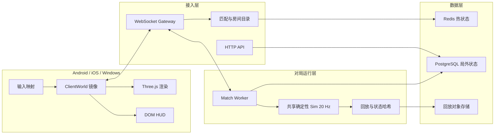
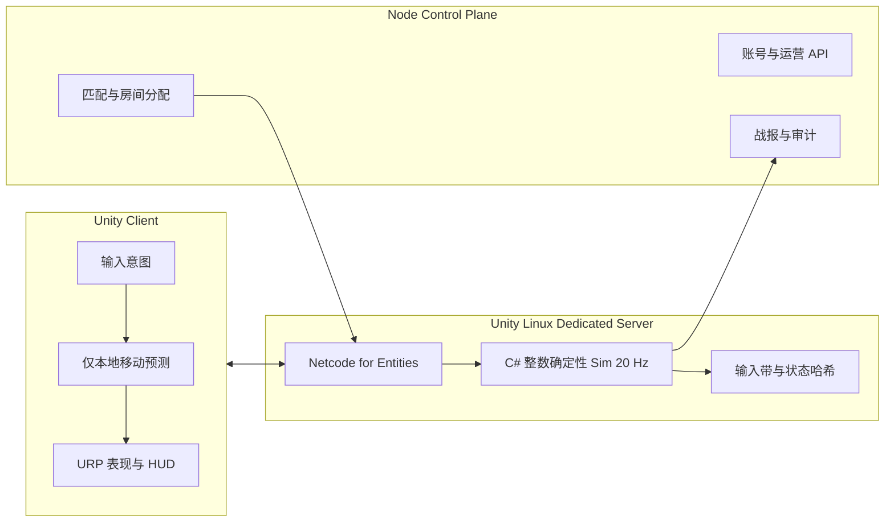

# 《三命无常》技术架构

文档版本：0.2.3
日期：2026-08-19
状态：记录当前 TypeScript Oracle 和 Unity 目标架构；U1 客户端基线采样进行中

## 架构状态

- 当前完整玩法闭环仍是 TypeScript、Three.js、DOM HUD、Node.js 和 `ws`；
  Unity 侧目前是可构建、可启动的迁移骨架。
- 当前 `packages/sim` 仍是唯一已实现、已测试的规则权威，也是 Unity 迁移的行为 Oracle。
- 生产目标已经改为 Unity 6.3 LTS、C# 整数确定性 Sim、Entities、Burst、Jobs、
  Netcode for Entities 和 Linux Dedicated Server。
- ADR-001 和 ADR-002 继续描述现有实现为什么成立，但其生产目标已被 ADR-005 取代。
- Unity `6000.3.20f1`、Android 和 Linux Server 工具链已安装，`unity/` 工程、
  C# Core、合成压力场、测试和构建入口已创建。
- UPM、C#/Burst、15 项 EditMode 测试和 Windows/Android/Linux 三类 IL2CPP
  构建已通过；Windows Player 和 WSL Linux Server 已完成 15 秒启动验证。
- 当前 Unity 侧仍只是迁移骨架、基础 Fixture 和合成 ECS/表现负载，不得把“能构建”
  写成“完整玩法已迁移”。
- 已有一次 Windows 开发机隐藏窗口吞吐样本和离屏截图，但没有 GPU 帧时、Release
  GC、低端移动真机或热稳态证据，U1 发布预算仍属于待验证目标。
- 详细阶段、版本和 Go/No-Go 门槛见 `docs/Unity迁移规划.md`。

## 1. 架构目标

本架构服务于以下产品约束：

- 30 人单人乱斗。
- Android、iOS、Windows 三端同服。
- 服务端权威。
- 固定 20 Hz 规则模拟。
- 目标局长 18 至 20 分钟，最长异常保护 30 分钟。
- 30 名英雄、123 个常驻怪物、理论 270 个召唤物，以及动态墙、陷阱、弹道和地面物。
- 同种子、同输入、同规则版本必须得到相同状态哈希。
- 客户端必须兼顾触屏低端设备和 Windows 高刷新率设备。

## 2. 参考工程结论

### 2.1 腾讯小游戏标准代码

参考目录：

`E:\angsa\angsa_data\Games\小游戏标准代码`

实际组成：

- Cocos Creator 2.4.9 客户端。
- GoFrame 2.7 运营 API。
- C++ Reactor 对局服务集群。
- Protobuf 二进制协议。
- Redis、SSDB、MySQL 分层存储。

采用的原则：

- HTTP 慢路径与 WebSocket 对局热路径分离。
- 网关只做鉴权、限流和路由，不解析全部游戏业务。
- 对局状态留在房间进程内存中。
- 二进制协议、连接复用、对象池、分包、预加载和主动资源回收。
- 匹配、房间、运营、日志和持久化可以独立扩容。
- 进程支持平滑上线、摘流和停机。

不直接照搬的部分：

- Cocos Creator 2.4.9 已不是本项目的目标运行时。
- 自研 C++ 网络框架维护成本过高。
- 棋牌的低频离散状态不能直接代表 30 人动作乱斗的连续移动和碰撞压力。
- 旧协议、旧 Redis 组织和 SSDB 不作为新项目依赖。

### 2.2 World of ClaudeCraft

参考目录：

`E:\angsa\angsa_data\Games\world-of-claudecraft`

参考提交：`ade7d21c9`
参考版本：`0.25.0`

采用的原则：

- 一份确定性 TypeScript Sim 运行于浏览器离线模式、权威服务端和无头环境。
- Sim 不导入 DOM、Three.js、网络和数据库。
- 渲染与 UI 只读取世界接口，不依赖具体 Sim 实现。
- 客户端只发送意图，服务端决定伤害、掉落和经济。
- Three.js 只负责表现。
- 服务端通过 WebSocket 推送兴趣域快照和事件。
- TypeScript strict、Vitest、Vite、esbuild、模块优先和完整工程门槛。

需要改造的部分：

- 本项目是短局 30 人乱斗，不需要 MMO 的长期开放世界状态。
- 地图几何、雾、弹道和碰撞密度更高，需要更严格的热路径数据布局。
- 匹配房间应彼此隔离，一个进程不能只承载一个永不重置的世界。
- 经济必须具备局内创建、转移、销毁三账本和幂等事务。

## 3. 技术选型

### 3.1 当前实现

| 层 | 选型 | 原因 |
|---|---|---|
| 语言 | TypeScript strict | 客户端、服务端、Sim、工具共享类型 |
| 3D 渲染 | Three.js | 直接控制渲染循环、适合固定斜俯视和多端 Web 宿主 |
| Web 构建 | Vite | 快速开发、按入口和动态导入拆包 |
| 服务端 | Node.js 22 + `ws` | 与共享 Sim 同语言，适合第一阶段权威房间服 |
| 服务端打包 | esbuild | 启动快，部署物简单 |
| 测试 | Vitest | 同一工具覆盖 Sim、协议、服务端和纯 UI 核心 |
| 桌面壳 | Electron | Windows 发布和更新 |
| 移动壳 | Capacitor | Android、iOS 共用 Web 运行时和原生桥 |
| 生产协议 | Protobuf | 小包体、稳定字段号、客户端服务端生成类型 |
| 当前 M2 协议 | 版本化 JSON v7 调试编解码器 | 已闭合输入、比赛状态、会话恢复和当前纵向切片字段；不作为 Unity 生产网络栈 |
| 持久化 | PostgreSQL | 账号、局外资产、战报、审计记录 |
| 热状态 | Redis | 匹配、会话、房间目录、限流和短时缓存 |
| 资源格式 | GLB/glTF 2.0、KTX2、WebP/AVIF | 标准化 3D 交付和压缩纹理 |
| 代码质量 | Biome、TypeScript、Vitest | 统一格式、类型和自动测试 |

### 3.2 Unity 生产目标

| 层 | 目标选型 | 原因 |
|---|---|---|
| Editor | Unity 6.3 LTS，当前补丁 `6000.3.20f1` | 锁定生产基线，不盲追 Supported Update |
| 三端客户端 | Unity Player + URP | Android、iOS、Windows 原生构建和统一资源管线 |
| 权威规则 | C# 整数数据导向 Sim | 保持 20 Hz、整数毫米、种子随机流和状态哈希合同 |
| 热路径 | Entities `1.4.8`、Burst `1.8.30`、Jobs | 数据布局、原生编译和可控并行 |
| 对局网络 | Netcode for Entities `1.14.1` + Unity Transport `2.6.0` | 服务器权威、Ghost、预测、插值和 Dedicated Server 集成 |
| 对局服务 | Linux Unity Dedicated Server | 承载生产 Match 热路径并剥离客户端资源 |
| 控制面 | Node.js | 保留登录、匹配、房间分配、战报、运营和慢路径 API |
| UI | UGUI/TMP 为战斗 HUD 基线 | 用真机重建成本决定，高频 HUD 不预设宣传结论 |
| 迁移验证 | TypeScript Oracle + Golden Fixtures + Unity Test Framework | 逐 tick 找到首个行为漂移 |

目标架构不使用 Netcode for GameObjects，不使用 MonoBehaviour/GameObject 承载大规模热
Sim，也不使用 PhysX/Rigidbody 决定权威运动和碰撞。

## 4. 总体架构

以下图是当前已实现架构：



以下图是迁移完成后的目标架构：



## 5. 代码仓库结构

当前结构：

```text
game-runtime/
├── apps/
│   ├── web/                    # Three.js 客户端和离线宿主
│   └── server/                 # HTTP、WS、房间调度和权威宿主
├── packages/
│   ├── core/                   # ID、整数数学、随机数、断言和公共值对象
│   ├── content/                # 英雄、技能、被动、装备、怪物和地图内容
│   ├── protocol/               # 客户端服务端共享线协议
│   └── sim/                    # 确定性游戏规则内核
├── tests/                      # 跨包单元、集成、确定性和架构守卫
├── docs/                       # 玩法、架构、规划和进度
└── tools/                      # 后续内容编译器、地图编译器和回放工具
```

迁移期间在同一仓库增加 `unity/` 和 `migration/fixtures/`。TypeScript 目录在 Unity
通过确定性、M1 等价、联机和三端 Gate 前继续保留，目标结构见
`docs/Unity迁移规划.md`。

## 6. 共享 Sim

### 6.1 约束

`packages/sim` 必须满足：

- 零 DOM 依赖。
- 零 Three.js 依赖。
- 零 WebSocket 和数据库依赖。
- 固定 20 Hz。
- 不读取墙钟。
- 不使用 `Math.random`。
- 状态可以完整序列化。
- 相同种子和输入序列产生相同状态哈希。

### 6.2 单位

- 时间：整数 tick。
- 位置：整数毫米。
- 角度：整数毫度，或规范化整数方向向量。
- 生命、护盾、攻击、金币和经验：整数。
- 中间伤害：确定的定点表示。
- 百分比：基点或百万分比整数，不使用不受控浮点分支。

### 6.3 Tick 阶段

每个 tick 使用稳定阶段顺序：

1. 收集并按玩家 ID、输入序列排序。
2. 验证生命状态和输入权限。
3. 更新移动意图。
4. 执行连续碰撞和合法位置修正。
5. 启动普攻、主动和交互。
6. 推进前摇、弹道、区域和召唤物。
7. 解析命中、控制、护盾和伤害。
8. 执行致死保护、真死、掉落和淘汰。
9. 更新怪物 AI、仇恨、回巢和迁移。
10. 更新商店、空投、地面物和天劫。
11. 结算事务账本和胜负。
12. 生成事件、快照差量和状态哈希。

### 6.4 数据布局

M0 允许使用小规模对象集合验证行为，但生产路径逐步收敛为：

- 稳定整数实体 ID。
- 密集组件数组。
- 稀疏索引到密集数组的映射。
- 热字段按结构分离存储。
- 每 tick 复用临时缓冲区。
- 弹道、区域效果和地面物使用对象池或稳定槽位。
- 移除实体时使用稳定删除策略，不能改变确定性排序。

### 6.5 系统边界

- `input-system`：输入权限、序列和意图状态。
- `movement-system`：整数运动、扫掠和边界。
- `targeting-system`：视野、扇区、距离和稳定排序。
- `combat-system`：索敌、普攻释放、主动提交和攻击调度。
- `basic-hit-system`：近战和远程普攻统一命中、B06、B17、五行和伤害提交。
- `passive-runtime`：被动槽查询、H009 白名单倍率和触发 tick 数值快照。
- `shield-system`：独立护盾实例、确定性吸收顺序和破盾收集。
- `shield-break-system`：按护盾创建序提交 B17 五级范围伤害。
- `blink-system`：方向回退、整数毫米路径扫描、连续实体弦长和最后合法点。
- `ice-coffin-system`：独立自锁无敌计时和行动权限判断。
- `projectile-system`：弹道生成、整数推进、连续扫掠、首次接触和归属快照。
- `status-system`：控制、增益、减益和周期效果。
- `lethal-protection-system`：B19、B20、G1 和未来致死保护的固定优先级事务。
- `death-system`：真死耗命、掉落、临时状态清理、灵魂飞行和淘汰。
- `match-ledger`：整局一次充能、永久层和不可因换装或换英雄恢复的状态。
- `storm-system`：安全区、普通天劫和灭世雷暴。
- `monster-system`：AI、仇恨、回巢和迁移。
- `economy-system`：金币账本、掉落和公开资源。
- `transaction-system`：拾取、购买、换英雄、黑山和空投。
- `replay`：输入记录、事件、快照和状态哈希。

### 6.6 确定性弹道

- 弹道是 Sim 中的权威实体，不是 Three.js 粒子或客户端计时器。
- 普通连弩使用 55,000 mm/s，长弓使用 45,000 mm/s；碰撞半径为 120 mm。
- 每 tick 按实体 ID 推进，并对整个移动段做连续扫掠。
- 首次接触按沿扫掠距离、阻挡体优先、实体 ID 排序。
- 普攻出伤增益和来源五行在释放时快照，五行克制按实际命中的角色结算。
- 所有者真死或淘汰不清除已释放弹道；目标淘汰会销毁仍在追踪该目标的弹道。
- 当前普通弹道最大累计飞行距离临时使用释放者的有效普攻射程，因此 G10 的 3 米普攻增距会扩大该预算；P17 后续接入时不得扩大该预算。
- 新弹道在释放 tick 进入状态和快照，从下一 tick 开始扫掠，固定半开时间语义。
- 风墙已经接入同一首次接触查询；静态实体墙和冻河等待 M3 正式碰撞几何。
- 快照、状态哈希、回放和协议必须包含弹道的目标、位置、速度、半径、基础伤害、来源元素、释放时出伤倍率、剩余距离和运动余数。

### 6.7 闪现、冰棺与静态几何

- D6 闪现不使用浮点射线裁决，而是在最多 15,000 个整数毫米样本上检查玩家胶囊与静态矩形的连续占用。
- 连续占用距离按并集计算，避免相接的小矩形把一堵厚墙拆成多个可穿片段。
- 1,500 mm 连续弦长允许通过，1,501 mm 起阻挡；终点仍在实体内时无条件回退。
- 静态矩形是比赛初始配置，构造时校验整数坐标、正面积、唯一 ID，并按稳定文本顺序规范化。
- 静态矩形进入世界快照、JSON 协议、状态哈希和回放带，确保相同输入只有在相同几何上才得到相同哈希。
- D21 使用独立 `iceCoffinTicks`，不复用 G1 的 `invulnerableTicks`，避免规则语义、HUD 和协议状态混淆。
- 冰棺伤害拦截位于护盾之前，行动锁由主动、移动和普攻系统共同读取；其他计时仍按正常 tick 推进。
- 当前静态矩形后端只闭合 D6 纵向切片。普通移动、视线、普通弹道和正式地图墙体仍需在 M3 接入统一碰撞几何。

### 6.8 普攻命中与代表被动

- 近战和远程弹道最终都调用同一个 `resolveBasicHit`，避免两套暴击、护盾和致死规则漂移。
- B06 在命中 tick 使用隔离的 `combat` 随机流抽取；五级先计算暴击总伤害，再把向下取整的 30% 生命子事件绕过护盾，余数进入普通护盾分支。
- B17 在触发伤害前抽取并创建独立护盾，所以新护盾能够吸收触发它的同一次普攻。
- B17 破盾效果作为护盾实例数据进入快照和哈希，多个同 tick 破盾效果按创建序提交。
- H009 只放大白名单内的被动效果量，不放大触发概率。B06 在命中 tick 读取倍率；B17 的护盾量和破盾伤害在触发 tick 快照。
- 同 tick 的玩家、弹道、护盾和淘汰提交均使用稳定实体 ID 或创建序，不依赖 Map 插入偶然性。

## 7. 世界接口

渲染、HUD 和输入宿主不直接依赖 `Sim`。

定义只读 `IWorldView`，按领域拆分：

- 实体列表和可见性。
- 玩家自身状态。
- 战斗状态和冷却。
- 地图与天劫。
- 地面物和交互目标。
- 商店与事务结果。
- UI 事件。

实现者：

- `LocalWorldHost`：浏览器离线或开发模式，直接运行 Sim。
- `ClientWorld`：在线模式，应用服务端快照和事件。
- `ReplayWorld`：回放浏览器。
- `HeadlessWorld`：BOT、压力测试和自动平衡。

截至 2026-08-19，Web 根路径先由 `GameShell` 提供大厅、匹配展示、选角、加载和
结算壳层；英雄锁定后才动态创建 `GameApp`，再由 `ClientWorldHost` 加入真实
WebSocket 房间。`?mode=online` 与无参数根路径行为一致，只有 `?mode=local`、
`active` 或 `spawn` 会启用浏览器本地/调试宿主。
客户端会在当前标签页保存玩家 ID 和轮换恢复令牌，在 120 秒窗口内自动恢复原实体和
输入确认序列。当前直接应用 10 Hz 权威快照，尚未实现插值、预测、完整房间生命周期
或带宽优化。

## 8. 网络架构

### 8.1 流量分层

HTTP 慢路径：

- 登录和账号。
- 局外配置。
- 战报。
- 商业化。
- 资源清单。
- 举报和客服。

WebSocket 热路径：

- 鉴权。
- 匹配入局。
- 输入。
- 心跳。
- 快照。
- 战斗和 UI 事件。
- 断线恢复。

### 8.2 输入

- 客户端采样物理输入并转换为稳定动作。
- 发送当前输入序列、客户端预测 tick 和按键位。
- 服务端拒绝旧序列、非法值和超频请求。
- 输入可按多个 tick 打包，降低移动网络包头开销。

### 8.3 快照

- 服务端模拟 20 Hz。
- 普通状态快照目标为 10 Hz。
- 战斗关键事件可在下一网络 flush 立即发送。
- 远离玩家或不可见实体降低更新频率。
- 迷雾外实体不发送精确位置。
- 大字段只在改变时发送。
- 快照携带服务端 tick、确认输入序列和基线 ID。

### 8.4 客户端表现

- 自身移动采用本地预测和服务端重校正。
- 其他实体使用插值缓冲。
- 短误差平滑修正，重大误差立即纠正并记录诊断。
- 客户端永远不预测伤害、掉落、金币和死亡结果。

### 8.5 生产协议

生产目标使用 Protobuf：

- 字段号只追加，不复用。
- 命令和事件使用闭合枚举。
- 每条消息有协议版本和规则版本。
- 网关按消息类型路由，尽量避免全量业务解码。
- 最大包体、输入频率和字符串长度必须受限。

当前 M2 使用版本化 JSON v7 调试协议，规则集为 `3.1.0-m1.4`。协议已经覆盖瞄准向量、被动负载、装备实例、独立护盾及破盾效果、致死保护计时、整局充能、冰棺、静态矩形、风墙、弹道基础伤害与释放快照、暴击、被动护盾、比赛结算状态和基础会话恢复。会话恢复是一次受控的小幅扩展；在继续增加预测、差量快照和兴趣域字段前必须迁移 Protobuf。

权威房间保留正常 20 Hz 墙钟驱动，同时提供显式单步接口和关闭房间定时器的测试选项。真实 WebSocket 房间可以与本地 `GameSimulation` 使用相同根种子、加入顺序和输入带逐 tick 对拍最终状态哈希。

恢复令牌由服务端使用 256 位随机数生成，内存中只保存 SHA-256 哈希。网络连接与玩家实体分开：

- 初次加入创建唯一玩家实体和恢复会话。
- socket 关闭时提交下一输入序列的静止意图，并进入 120 秒 `disconnected` 状态。
- 有效令牌恢复时重新绑定原实体、沿用确认序列并轮换令牌。
- 新页面在旧连接关闭事件到达前恢复时，可以凭有效令牌接管；旧连接失去绑定。
- 超过截止时间后会话变为 `expired`，凭证不可再次使用。
- 恢复、过期和接管不调用 `GameSimulation.addPlayer`，不消费出生随机流，也不复制装备或整局账本。

恢复过期后的玩法处置尚无真源规则。当前只让实体保持静止并继续参与权威 Sim；不会在网络层擅自删除、判死或改写比赛名次。比赛结束后的房间销毁、重建和匹配复用也仍未实现。

## 9. 服务端进程模型

### 9.1 第一阶段

使用模块化单体：

- 一个 HTTP/WS 接入进程。
- 一个进程内可运行多个 MatchRoom。
- 每个房间拥有独立 Sim、随机根种子、输入队列和回放。
- 房间错误不能影响其他房间，边界处捕获并转为房间中止。

### 9.2 扩展阶段

拆分为：

- API 服务。
- WebSocket Gateway。
- Matchmaker。
- Match Worker 池。
- Persistence Worker。
- Replay Worker。
- Telemetry Worker。

每个 Match Worker 承载若干对局，按 tick 时间预算动态限载。

### 9.3 Unity Match 迁移边界

原先“TypeScript 超预算后再把热点下沉到 Rust/C++”的备用路线已被 ADR-005 取代。
生产 Match 热路径整体迁移到 C# 整数 Sim 和 Unity Dedicated Server：

- 保持输入带、状态哈希、规则版本和行为合同不变。
- Node 继续负责控制面，不继续承担生产对局 tick。
- TypeScript Sim 在迁移期间只作为 Oracle、Fixture 生成器和回退基线。
- C# 在明确的 Burst/Jobs 压测后仍无法达标时，才讨论更低层原生模块。
- 任何更低层迁移仍必须通过相同 Golden Fixtures，不能改变客户端权威边界。

## 10. 客户端架构

本节 10.1 至 10.4 描述当前已实现的 Web 客户端。Unity 目标客户端使用 URP、
UGUI/TMP、Unity Input System、池化和平台质量档；详细预算与替换顺序见
`docs/Unity迁移规划.md`。

### 10.1 渲染

- Three.js 只渲染世界接口。
- 固定斜俯视相机。
- 逻辑视口固定 16:9。
- 宽屏区域只显示装饰。
- 地形、静态墙、地面物、单位和 VFX 分层管理。
- 渲染对象使用池和稳定资源引用。

### 10.2 HUD

DOM HUD 负责：

- 玩家生命、护盾、等级、经验和三命。
- 主动 CD。
- 四个被动槽。
- 三件装备和手牌。
- 宝石仓。
- 天劫计时和安全区信息。
- 小地图。
- 情境交互、替换和交易界面。

### 10.3 输入

物理输入统一映射为动作：

- `move`
- `basic-attack`
- `active-press`
- `active-aim`
- `interact`
- `cycle-interaction`
- `cancel`
- `map`
- `status`

UI 模态会显式占用动作，不允许按钮点击穿透到世界。

### 10.4 移动端体验

- 触控目标不小于 72 逻辑像素。
- 摇杆支持固定与浮动模式。
- 施法预览优先显示合法落点。
- 弱网、后台切回和横竖屏变化都有明确状态。
- 低性能模式可以降低阴影、粒子、LOD 和后处理，不能隐藏敌方位置、预警或状态。

## 11. 资源管线

- 生产模型统一导出 GLB。
- 纹理优先 KTX2，UI 图片优先 WebP 或 AVIF。
- 每个模型提供碰撞代理、LOD、锚点和预算元数据。
- 角色、怪物、环境、UI、音频和 VFX 使用稳定资源 ID。
- 文件名不是运行时 API。
- 启动包只包含登录、基础 HUD 和第一个战斗场景必需资源。
- Web V1 的大厅首包与战斗运行时分离；战斗 Three.js、地图、模型和高频 HUD 代码
  在英雄锁定后的加载阶段动态请求，避免大厅下载完整战斗包。
- 英雄、怪物、区域和终局资产按 Bundle 分包。
- 进入对局前预热常用材质、动画、投射物和伤害数字。
- 离开房间后按引用计数释放。

## 12. 数据和内容编译

目标真源结构：

```text
content/
├── schema/
├── heroes/
├── actives/
├── passives/
├── equipment/
├── monsters/
├── map/
└── release-gates/
```

内容编译器必须：

- 验证 ID 唯一。
- 验证闭合枚举。
- 验证单位。
- 验证引用。
- 验证强类型载荷。
- 计算规范化内容哈希。
- 生成 TypeScript 数据、服务端快照和文档投影。
- 拒绝正文和工程字段漂移。

Word 文档最终只能作为机器生成的阅读投影，不能继续手工维护运行时 JSON。

## 13. 持久化

PostgreSQL：

- 账号、设备和封禁。
- 局外修为、外观、图鉴和设置。
- MMR 和战报。
- 举报、审计和事务摘要。

Redis：

- 登录会话。
- 匹配队列。
- 房间目录。
- 网关路由。
- 限流。
- 临时断线票据。

对局内状态：

- 只存在于 Match Worker 内存和回放日志。
- 不在每 tick 写数据库。
- 对局结束或异常中止时提交结算。

## 14. 安全与反作弊

- 客户端输入逐字段验证。
- 速度、施法频率、目标、距离和事务均服务端验证。
- 客户端不能上传金币、伤害、掉落和生命结果。
- WS 首包鉴权。
- 会话和角色加载使用租约，避免双加载。
- 重复事务 ID 返回原结果，不重复执行。
- 敏感操作写审计账本。
- 服务端保留输入、回放和状态哈希，用于举报复核。
- 开发命令只在显式开发环境开启。

## 15. 性能预算

以下是 Unity 迁移的暂定目标，不是已验证结果。最低硬件仍需产品确认，完整矩阵见
`docs/Unity迁移规划.md`。

### 15.1 服务端

- 固定 tick：50 ms。
- 基准环境：固定并记录 CPU 型号、Linux 版本和构建参数的 4 vCPU 机器。
- 最低压力场：30 玩家、123 常驻怪物、270 召唤物和设计峰值动态实体。
- P95 单房间模拟时间：不超过 4 ms。
- P99 单房间模拟时间：不超过 8 ms。
- 30 分钟持续压力测试中不能有 tick 超过 50 ms。
- Sim 热路径托管分配：0 B/tick。
- 网络编码、日志和持久化不在 Sim 热路径同步执行。
- 对局进程内存必须有硬上限和过载摘流机制。

### 15.2 客户端

- Snapdragon 680 / Adreno 610 / 4 GB 暂定为低端 Android 30 FPS 底线。
- Snapdragon 778G、iPhone 11 和 i5-8400 + GTX 1060 暂定为 60 FPS 基线。
- 60 FPS 档主线程 P95 不超过 5.5 ms，GPU P95 不超过 13 ms。
- 30 FPS 档主线程 P95 不超过 10 ms，GPU P95 不超过 25 ms。
- 稳态战斗托管分配为 0 B/frame。
- 20 分钟以上真机热稳态不能跌破目标档位。
- 常规战斗不使用同步资源加载。
- 动态分辨率只影响表现，不影响视野和命中。

当前 U1 表现基线采用独立 `Jwgb.Client.Presentation` 程序集：

- `SyntheticStressPresenter` 只读 ECS 位置和 Agent 类型，不修改权威状态。
- 三类 Agent 使用预分配矩阵和 `Graphics.RenderMeshInstanced`，当前基线每帧三批。
- `SyntheticPerformanceSampler` 记录帧分布、主线程和可用内存计数器，并将不可用
  Release `GC.Alloc` 明确标为 `false/-1`。
- 2026-07-24 Windows Release IL2CPP 隐藏窗口样本为 423 Agent、15 秒、
  130,136 帧、0 丢样，帧时间 P95 `0.184595 ms`，主线程 P95 `0.181 ms`。
- 该数据只证明轻量 Agent 表现桥可运行，不包含完整动态实体、GPU 帧时、显示呈现、
  真机热稳态或发布硬件结论。

### 15.3 网络

- 目标 RTT P95 不超过 80 ms。
- 输入包可合并。
- 快照按兴趣域和变化裁剪。
- 平均每客户端下行目标不超过 25 KB/s，P95 不超过 60 KB/s。
- 断线重连不复制实体、金币、物品、随机消耗或事务结果。

## 16. 可观测性

服务端指标：

- 房间数、在线人数和匹配等待时间。
- tick 平均值、P95、P99 和超时次数。
- 每阶段耗时。
- WS 输入和输出字节。
- 快照实体数和差量命中率。
- 事务拒绝、重复和回滚。
- 回放哈希错误。

客户端指标：

- FPS、帧时间和卡顿。
- 托管堆、Native 内存和 GPU 资源。
- 网络 RTT、抖动、丢包和重连。
- 预测误差和重校正距离。
- 资源加载、失败和缓存命中。

## 17. 测试门槛

- 单元测试：随机数、整数数学、伤害、控制、死亡、经济和事务。
- 确定性测试：同种子同输入状态哈希相同。
- 回放测试：记录后重放逐阶段一致。
- 架构测试：Sim 禁止 DOM、Three、网络、墙钟和 `Math.random`。
- 协议测试：客户端发送集合与服务端处理集合闭合。
- 集成测试：两个真实 WS 客户端完成加入、移动、攻击、死亡和重连。
- 压力测试：30 玩家、123 怪物、270 召唤物和动态实体。
- 浏览器测试：桌面和移动尺寸下的 HUD、输入和 WebGL。
- 真机测试：Android、iOS、Windows 性能和后台恢复。

截至 2026-07-24 的自动化基线为 26 个测试文件、86 项测试。已覆盖 1000 种根种子
战斗回放无哈希漂移、真实 WS 权威房间与本地 Sim 最终哈希一致、30 席容量边界、
完整 BOT 对局和基础会话恢复。Unity 迁移必须把这些行为合同转为 Golden Fixtures、
Unity 测试或双运行时逐 tick 对拍，不能只重做相似画面。

## 18. 架构决策

### ADR-001：Three.js 而不是 Cocos Creator 2.4.9（当前实现）

原因：

- 目标是 Android、iOS、Windows，不是只发布旧微信小游戏。
- 与共享 TypeScript Sim 和 ClaudeCraft 参考架构直接兼容。
- 固定斜俯视、DOM HUD、Web/Electron/Capacitor 多宿主更自然。
- 该决策仍解释当前可运行基线，但生产目标已被 ADR-005 取代。

### ADR-002：共享 TypeScript Sim（当前实现）

原因：

- 能在服务端、离线、BOT、回放和测试中运行同一逻辑。
- 避免客户端和服务端各写一套规则。
- 第一阶段开发速度和验证效率最高。
- 该实现迁移期间继续作为行为 Oracle，生产目标已被 ADR-005 取代。

### ADR-003：生产 Protobuf，纵向切片允许版本化 JSON

原因：

- Protobuf符合腾讯样例的热路径经验。
- M0/M1 优先验证模块边界、游戏规则和快照字段闭合。
- 编解码器接口必须从第一天存在，不能让业务代码直接调用 JSON。
- JSON 调试协议必须有显式版本；进入 M2 完整在线宿主前迁移 Protobuf。

### ADR-004：权威运动和碰撞不依赖 Three.js

原因：

- Three.js 场景对象是表现层。
- 规则碰撞必须可在 Node、浏览器和无头测试中一致运行。
- 位置采用整数毫米，连续扫掠由 Sim 负责。

### ADR-005：Unity 6.3 LTS 作为三端和生产 Match 目标

决策：

- 客户端迁移到 Unity 6.3 LTS 和 URP。
- 权威规则迁移到 C# 整数数据导向 Sim。
- 热路径使用 Entities、Burst 和 Jobs。
- 对局网络使用 Netcode for Entities 和 Unity Transport。
- 生产 Match 使用 Linux Unity Dedicated Server。
- Node 保留为控制面。
- TypeScript Sim 在迁移 Gate 全部通过前保留为行为 Oracle。

原因：

- Unity 原生覆盖 Android、iOS、Windows 和 Dedicated Server 构建。
- Entities、Burst 和 Jobs 提供适合本项目高动态实体压力场的数据布局和原生热路径。
- Netcode for Entities 与服务器权威、预测和插值模型一致。
- 继续使用整数规则内核可以避免把跨 ARM/x64 的公平性押在通用物理引擎上。
- 迁移通过 Golden Fixtures 和逐 tick 对拍完成，不以引擎替换为理由重写玩法规则。

状态：

- 决策已记录。
- Unity U0 工具链、包锁、C#/Burst 编译、15 项 EditMode 测试和三类 IL2CPP
  构建已获得证据。
- Windows Player 和 Linux Dedicated Server 已启动验证；Android APK 已完成
  静态结构、SDK、ABI、安装位置和调试签名验证，但没有连接设备可做真机启动。
- C# Core 和 423 实体合成/表现负载已有基础运行与开发机采样证据；完整状态、回放、
  M1 战斗、Netcode 对局、GPU/GC、真机和持续性能数据仍未迁移。
- 目标只有在性能、确定性、联机和三端 Gate 获得证据后才能取代当前生产候选。
